# Intellij setup guide for 102/103

## Why Intellij

- You already know it :P

  TBD

## How to setup

0. Get licenses 

   To get licenses for all JetBrains tools, apply [here](https://www.jetbrains.com/community/education/#students) using your uni email address, or GitHub account with *GitHub Student Developer Pack* if you already have it.

   You will need to renew it every year. 

   I think **Community Edition**(Free) is enough for 103. You don't need to get a license to use Community Edition.

   Lab machines already have **Ultimate Edition** ready to use.

   

1. Download JDK 11:

   There're multiple kinds of JDK, and anyone of them should be fine.

   [Link to Oracle JDK 11.](https://www.oracle.com/java/technologies/javase-jdk11-downloads.html) You might need to register before download. I *hate* it.

   After JDK installed, IntelliJ should be able to detect it.

   

2. Download Intellij IDEA

   Download edition you want from [here](https://www.jetbrains.com/idea/download/).

   You can install and install from JetBrain Toolbox if you like.

   

3. Install IntelliJ

   We don't need to talk about this, are we?

   

4. Configure

   *Note: I'm using plugins, your Intellij might look a little bit different from mine.*

   After install, you can open IntelliJ, and it should look like:

   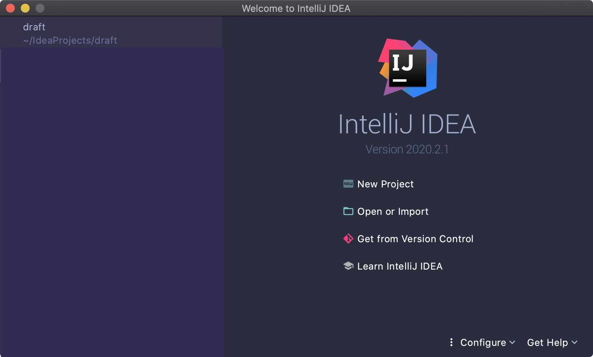

   You need to install JDK before start work on your program if you don't have one. See Step 1.

   - Open a COMP103 assignment:

     Click on `Open or Import` and select the unzipped folder for your assignment. I'll use Assignment 3 as an example.

     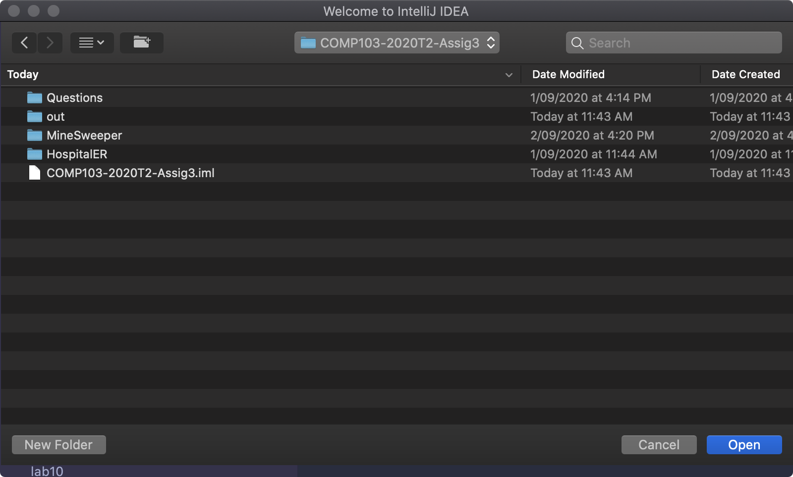

     

     Click `Open`, and you should see this:

     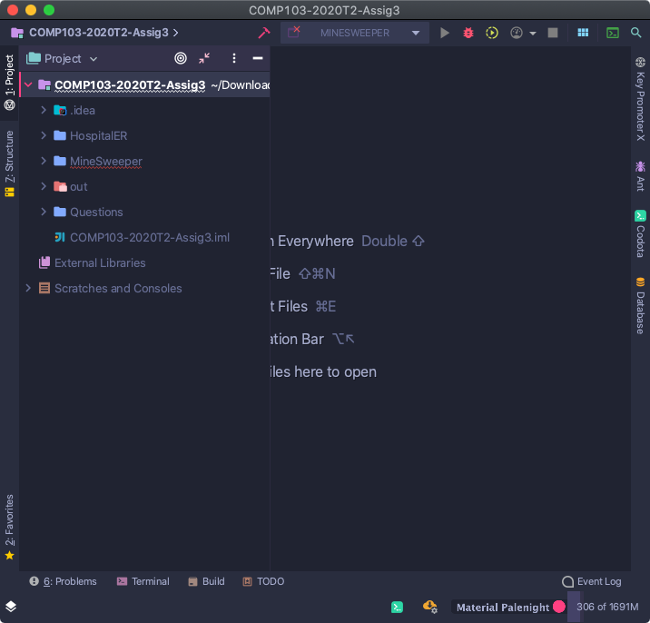

     You might found that the `Run` button is disabled, that's because we don't have JDK selected.

     We need to select JDK first.

     Click on the Project Structure button on the right top side.

     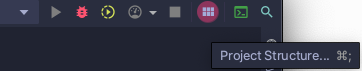

     

     Go to `Project Settings` -> `Project` 

     We can see that we don't have any SDK selected. 

     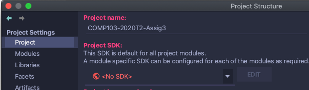

     *Note: I already have many versions of JDK installed, so my Project SDK list is not empty.*

     In the `Detected SDKs` section, you will see an option of JDK 11. Click on it:

     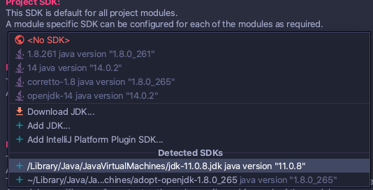

     Now you should have '11 java version "11.0.8"` in your Project SDK Combobox:

      

     Then go to `Project language level` and choose `SDK default`.

     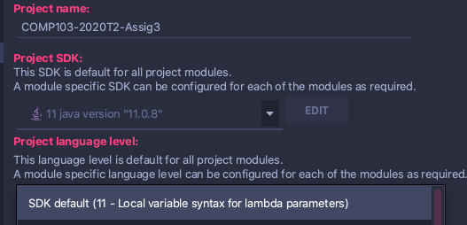

5. Click `OK`, and you are done for SDK setting.

   

6. Import ecs100.jar

   [Download ecs100.jar here.](https://ecs.wgtn.ac.nz/foswiki/pub/Courses/COMP103_2020T2/JavaResources/ecs100.jar)

   Store it somewhere, and we'll import it.

   Click on `Project Structure` again, this time we go to `Platform Settings`->`Global Libraries`:

   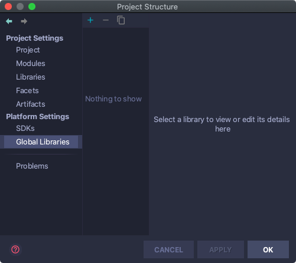

   Click the `New Global Library` button:

   

   Choose `Java`

   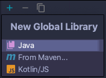

   And select your `ecs100.jar` file.

   If you see this window, click `OK`.

   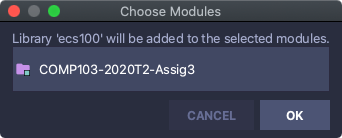

   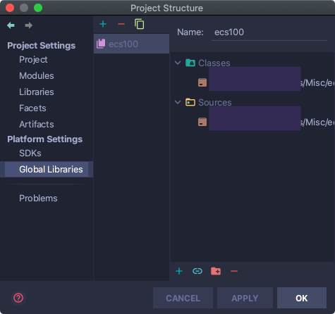

If you see this, click `OK` and you're good to go!

Now you can run your COMP103 assignment in IntelliJ by doing this: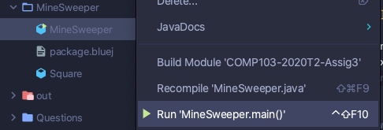

However, if your code contains problems, you may fail to compile your program.

Tips: If you want to work with codes in a folder, you can unmark other folders by right click on the folder and select `Mark Directory as ` -> `Mark/Unmark as Sources Root`. IntelliJ will not compile codes in folders that not marked as a `Sources Root`.

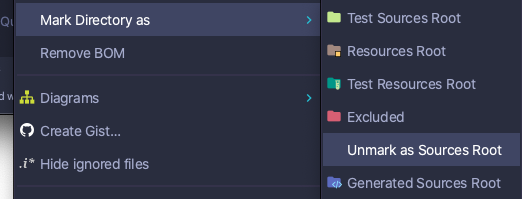

